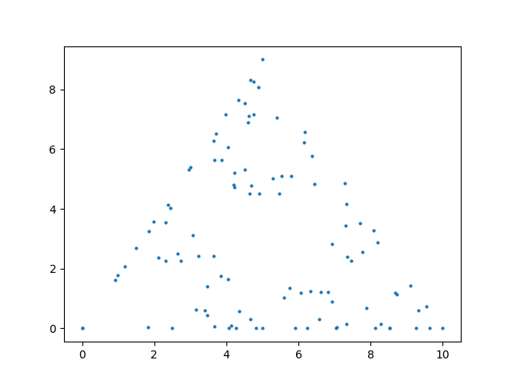
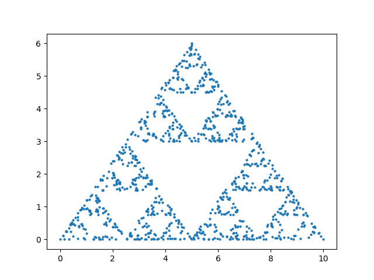
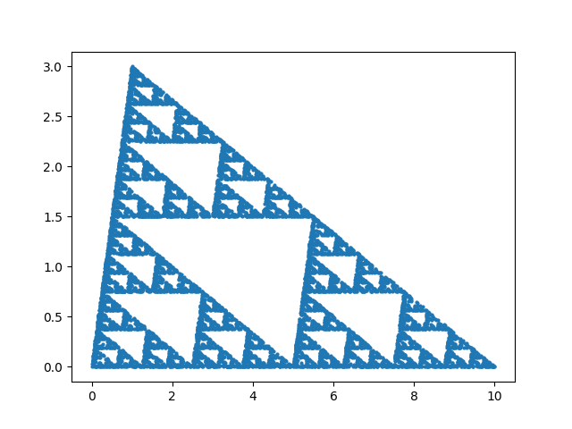
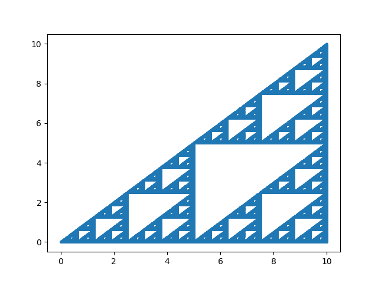

#  Sierpinsky Triangle

Renders traingular patters ( [Sierpinsky Triangle](https://en.wikipedia.org/wiki/Sierpi%C5%84ski_triangle) ) like the ones given in the images below using the matplotlib graphing library in [Python](https://www.python.org/).







## Installation and Usage


### Cloning the repo

Use the following git command :

```bash
git clone https://github.com/AabhasKrJha/sierpinsky-triangle.git
```

and then change the dir using the following command :

```bash
cd sierpinsky-triangle
```


### Installation

Run the following command in your terminal to install [matplotlib](https://matplotlib.org/) using [pip](https://pip.pypa.io/en/stable/) globally.

```bash 
pip install matplotlib
```

To create and use a virtual environment use the following commands step by step :

Windows : 

```bash 
python3 -m venv venv
```

```bash 
.\venv\Scripts\activate
```

```bash
pip install matplotlib
```

MacOS / Linux distros :

```bash 
python3 -m venv venv
```

```bash 
source venv/bin/activate
```

```bash
pip install matplotlib
```


### Usage

```bash
python3 main.py
```


#### Deactivate Virtual Environment

To decactivate the virtual environment just use the command :
```bash
deactivate
```